import Image from 'next/image'

## The Homelab roadmap

import { Callout } from 'nextra/components'

<Callout>
  The roadmap below follows a chronological order, organized vertically from top to bottom. Each step or sub-step is interactive—clicking on it will take you directly to its detailed documentation. Within the roadmap, some steps offer multiple options. Recommended options are marked with a purple checkbox, while alternative choices are indicated with green checkboxes

```mermaid
%%{init: {'theme':'base'}}%%

flowchart TD
    subgraph planning_homelab["Planning a Homelab"]
        hardware_selection(Hardware Selection)
        software_selection(Software Selection)
        automation_strat(Automation Strategy)
        click hardware_selection "https://your-wiki-url.com/step-1-research-hardware-options"
    end

    subgraph hardware_selections["Hardware Selections"]
       mini_pc(✅  Mini PC)
       raspberry_pi(👌 Raspberry Pi)
       server(👌 Server)
    end

    subgraph automation_strategies["Automation Strategies"]
       config_mgmnt(Config Management)
       infra_prov(Infra Provisioning)
       git_ops(GitOps)
    end

    subgraph config_management["Config Management Tools"]
       ansible(✅ Ansible)
       puppet(👌 Puppet)
    end
 

   subgraph infra_provisioning["Infra Provisioning Tools"]
       terraform(✅ Terraform)
       pulumi(👌 Pulumi)
    end

    subgraph foo["GitOps Tools"]
       argocd(✅ ArgoCD)
       flux(👌 Flux)
    end

   subgraph config_hardware["Configure Hardware"]
        baremetal(Baremetal)
        hypervisor(Tier 1 Hypervisor)
    end


hardware_selection --> hardware_selections
automation_strat ---> automation_strategies
config_mgmnt --> config_management
infra_prov --> infra_provisioning
git_ops --> foo

planning_homelab --> config_hardware
```

</Callout>

